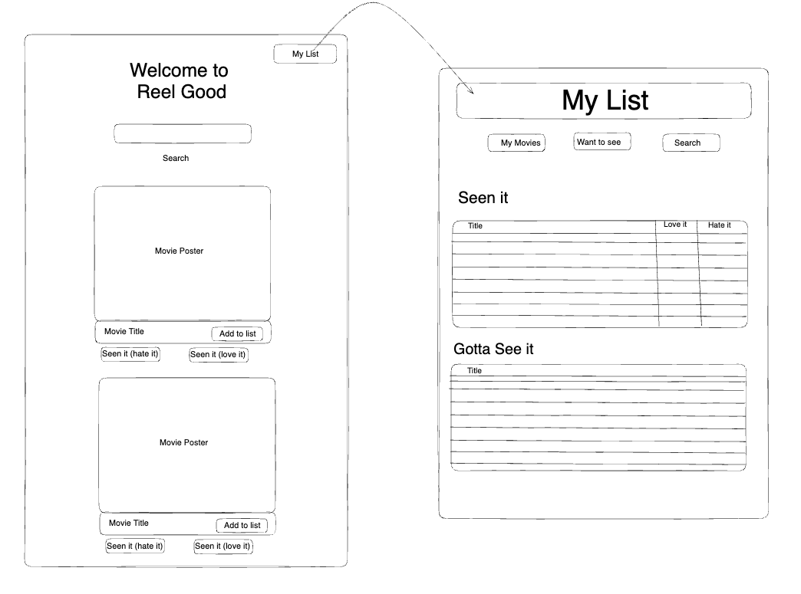

# ReelGood movie database

The ReelGood movie database app provides users with a comprehensive and user-friendly platform to search for movies and manage their movie watching activities. Its primary objective is to enhance users' overall movie viewing experience by making it easy for them to find and explore new movies. The app's features, such as the love it or hate it rating system, help users keep track of their movie preferences and make better-informed decisions when choosing what to watch next.

## Features
- **Movie Search:** Users can search for movies using keywords or movie titles in the search bar and rate the movies they have seen directly on the search screen using "Seen it(Love it)" and "Seen it(Hate it)".

- **Watchlist:** Users can add movies to their watchlist and view them later. They can also rate movies as "Reel-y Love it" or "Reel-y Hate it" to keep track of their movie preferences.

- **Streaming Platform Information:** Users can conveniently view the streaming platforms currently offering the movie from the search results page, saving them time and effort when identifying where to watch the movie.

- **Concept:** The ReelGood movie database app was born out of the creator's love for movies and the desire to keep track of their preferences. The app aims to provide a streamlined and user-friendly experience for movie enthusiasts, enabling them to easily discover, track, and enjoy their favorite movies.

## Installation

Follow these steps to set up the Movie Watchlist web app on your local machine:

- Clone the repository from GitHub: `git clone [git@github.com:notalisk/my-movie-list.git]`

 ## Instructions.  <!--(ADD IMAGES) -->

Here's how you can use the Movie Watchlist web app:

1. Search for Movies:
   - Enter keywords or movie titles in the search bar and click the search button.
   - View the search results, which display movie details such as title, and streaming platform information.
   - Click on a movie to view its details page.
   - Rate the movies on this screen by "Seen it(Love it) or "Seen it(Hate it)"

2. Add Movies to Watchlist:
   - On the movie details page, click the "Add to Watchlist" button to add the movie to your watchlist.
   - The movie will be added to your watchlist, and you can view it later in the watchlist section.

3. View Watchlist:
   - Click on the "Watchlist" link in the navigation bar to view the movies in your watchlist.
   - The watchlist page displays the movies titles you have added.
   - Rate the movies on this list screen with "Reel-y Love it" or "Reel-y Hate it"

## Technologies Used

- This code was developed in VScode using HTML, CSS, JavaScript, JQuery and Materialize. 
- Initial design was sketched on Excalidraw

## APIs Used

- Searching movie content is made possible through 'Advanced Movie Search' 
"https://rapidapi.com/jakash1997/api/advanced-movie-search/"
- API keys are available at the above mentioned site. 

- Streaming availability is made possible through 'Watchmode'
"https://rapidapi.com/meteoric-llc-meteoric-llc-default/api/watchmode/"

## Wire Frame

## Contributors
\
-Ellen Kolbly: <https://github.com/notalisk> \
-Christian Asberry:  <https://github.com/Cristian01021>\
-Frank Orona: <https://github.com/Oronafrankie87>\
-Edward Wells: <https://github.com/Edwardwells87>

## License

- MIT License

Copyright (c) 2023 Ellen Kolbly

Permission is hereby granted, free of charge, to any person obtaining a copy
of this software and associated documentation files (the "Software"), to deal
in the Software without restriction, including without limitation the rights
to use, copy, modify, merge, publish, distribute, sublicense, and/or sell
copies of the Software, and to permit persons to whom the Software is
furnished to do so, subject to the following conditions:

The above copyright notice and this permission notice shall be included in all
copies or substantial portions of the Software.

THE SOFTWARE IS PROVIDED "AS IS", WITHOUT WARRANTY OF ANY KIND, EXPRESS OR
IMPLIED, INCLUDING BUT NOT LIMITED TO THE WARRANTIES OF MERCHANTABILITY,
FITNESS FOR A PARTICULAR PURPOSE AND NONINFRINGEMENT. IN NO EVENT SHALL THE
AUTHORS OR COPYRIGHT HOLDERS BE LIABLE FOR ANY CLAIM, DAMAGES OR OTHER
LIABILITY, WHETHER IN AN ACTION OF CONTRACT, TORT OR OTHERWISE, ARISING FROM,
OUT OF OR IN CONNECTION WITH THE SOFTWARE OR THE USE OR OTHER DEALINGS IN THE
SOFTWARE.

## Links
- Repository: 
https://github.com/notalisk/my-movie-list

- Live App

